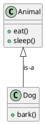
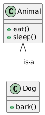
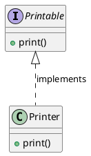
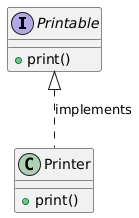
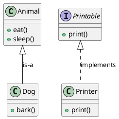
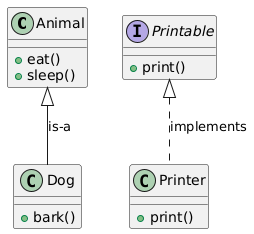

# Generalization vs Realization

Generalization and realization are both relationships in UML class diagrams, but they serve different purposes and have distinct characteristics. Let's explore the differences and see how they are used in practice with PlantUML examples.

### Generalization (Inheritance)
- **Purpose**: Generalization, also known as inheritance, is used to represent an "is-a" relationship between a more general superclass and a more specific subclass.
- **Characteristics**: In this relationship, the subclass inherits attributes and methods from the superclass. It means that the subclass is a specific type of the superclass.

### Realization (Implementation)
- **Purpose**: Realization is used to show that a class implements an interface. An interface defines a contract of methods without providing their implementation.
- **Characteristics**: In this relationship, the implementing class must provide concrete implementations for all methods defined in the interface.

### Example of Generalization





- **Explanation**: Here, `Dog` inherits from `Animal`, indicating that a dog is a type of animal. `Dog` will have the methods `eat()` and `sleep()` from `Animal`, along with its own method `bark()`.

### Example of Realization





- **Explanation**: Here, `Printer` implements the `Printable` interface, meaning that `Printer` must provide an implementation for the `print()` method defined in the `Printable` interface.

### Combined Example

Let's put both relationships into one diagram to see the distinction clearly:





### Key Differences

1. **Generalization (Inheritance)**:
   - Represents an "is-a" relationship.
   - A subclass inherits methods and attributes from the superclass.
   - Example: `Dog` is a type of `Animal`.

2. **Realization (Implementation)**:
   - Represents an "implements" relationship.
   - A class provides concrete implementations for methods defined in an interface.
   - Example: `Printer` implements the `Printable` interface.

### Visual Difference in PlantUML

- **Generalization**: Uses a solid line with a hollow arrow pointing towards the superclass.
  ```plantuml
  Animal <|-- Dog
  ```
- **Realization**: Uses a dashed line with a hollow arrow pointing towards the interface.
  ```plantuml
  Printable <|.. Printer
  ```

Understanding these distinctions helps in designing clear and maintainable object-oriented systems, where the relationships between classes and interfaces are explicitly defined and easily understood. If you need further clarification or additional examples, feel free to ask!