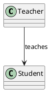
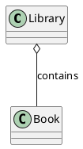
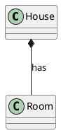

# Class diagram relations

## Association

- **Description:** This represents a relationship between two classes that need to communicate with each other.
- **Example:** A **Teacher** teaches a **Student**.

## Aggregation

- **Description:** This is a special form of association that represents a "whole-part" relationship but with weaker bonds. The part can exist independently of the whole.
- **Example:** A **Library** contains **Books**, but a **Book** can exist without the **Library**.

## Composition

- **Description:** This is a stronger form of aggregation where the part cannot exist without the whole. If the whole is destroyed, the parts are too.
- **Example:** A **House** has **Rooms**. If the **House** is destroyed, the **Rooms** are too.

