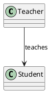
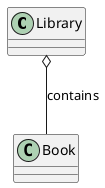

# Class diagram relations

## Association

- **Description:** This represents a relationship between two classes that need to communicate with each other.
- **Example:** A Teacher teaches a Student.

## Aggregation

- **Description:** This is a special form of association that represents a "whole-part" relationship but with weaker bonds. The part can exist independently of the whole.
- **Example:** A Library contains Books, but a Book can exist without the Library.

