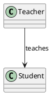
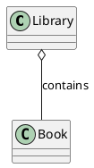

# Class diagram relations

## Association

```plantuml
@startuml
class Teacher
class Student

Teacher --> Student : teaches
@enduml
```

## Aggregation

```plantuml
@startuml
class Library
class Book

Library o-- Book : contains
@enduml
```

