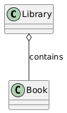

# Class diagram relations

## Overview

## Association

- **Description:** This represents a relationship between two classes that need to communicate with each other.
- **Example:** A **Teacher** teaches a **Student**.

## Aggregation

- **Description:** This is a special form of association that represents a "whole-part" relationship but with weaker bonds. The part can exist independently of the whole.
- **Example:** A **Library** contains **Books**, but a **Book** can exist without the **Library**.

## Composition

- **Description:** This is a stronger form of aggregation where the part cannot exist without the whole. If the whole is destroyed, the parts are too.
- **Example:** A **House** has **Rooms**. If the **House** is destroyed, the **Rooms** are too.

## Inheritance (Generalization)

- **Description:** This represents an "is-a" relationship. A child class inherits attributes and methods from a parent class.
- **Example:** A **Dog** is an **Animal**.

## Realization

- **Description:** This relationship is used to show that a class implements an interface.
- **Example:** A **Printer** implements a **Printable** interface.

## Full Example

## Referrences
- [https://www.umlboard.com/docs/relations/](https://www.umlboard.com/docs/relations/)